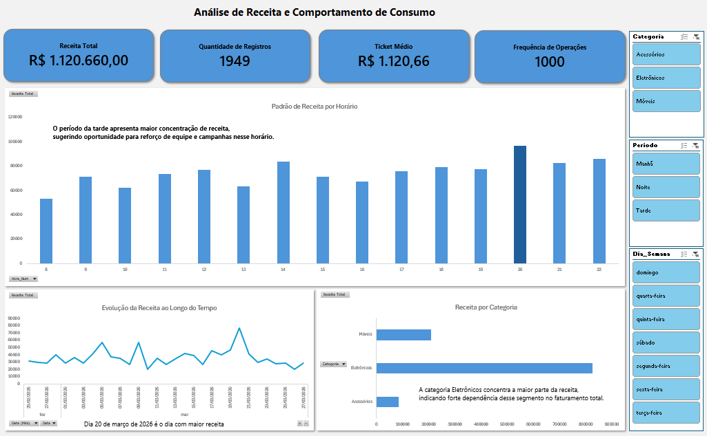

# 📊 Análise de Receita e Comportamento de Consumo

## 📌 Sobre o Projeto

Este projeto tem como objetivo analisar o comportamento de receita de uma operação comercial, identificando padrões de consumo, tendências ao longo do tempo e oportunidades de otimização.

A análise foi desenvolvida utilizando Excel, com foco em transformação de dados, criação de métricas estratégicas e construção de um dashboard interativo.

---

## 🎯 Objetivos da Análise

* Avaliar o desempenho financeiro da operação
* Identificar padrões de consumo por horário
* Analisar a distribuição de receita por categoria
* Detectar tendências e variações ao longo do tempo
* Gerar insights para apoio à tomada de decisão

---

## 🛠️ Ferramentas Utilizadas

* Excel (Tabelas Dinâmicas, Segmentações e Dashboard)
* Modelagem de dados
* Análise exploratória de dados (EDA)

---

## 📊 Principais Métricas

* Receita Total
* Ticket Médio
* Frequência de Operações
* Crescimento percentual
* Média móvel de receita

---

## 📈 Análises Realizadas

* Evolução da receita ao longo do tempo
* Receita por categoria de produto
* Padrão de consumo por horário
* Identificação de picos de faturamento
* Análise de tendência com média móvel

---

## 💡 Insights Estratégicos

* A categoria Eletrônicos concentra a maior parte da receita, indicando forte dependência desse segmento no faturamento total.

* O período da tarde apresenta maior concentração de receita, sugerindo oportunidade para reforço de equipe e campanhas nesse horário.

* A análise temporal indica variações relevantes ao longo dos dias, com presença de picos isolados de faturamento.

* A média móvel aponta uma tendência estável, com oscilações pontuais que podem estar associadas a fatores externos ou sazonais.

---

## 📌 Conclusão

A análise permitiu identificar padrões importantes de consumo e oportunidades de otimização operacional, demonstrando como dados podem ser utilizados para apoiar decisões estratégicas.

---

## 📷 Dashboard

---

## 🚀 Autor

Higgor Sampaio Alves
Estudante de Ciência de Dados
Foco em Análise de Dados e Business Intelligence
